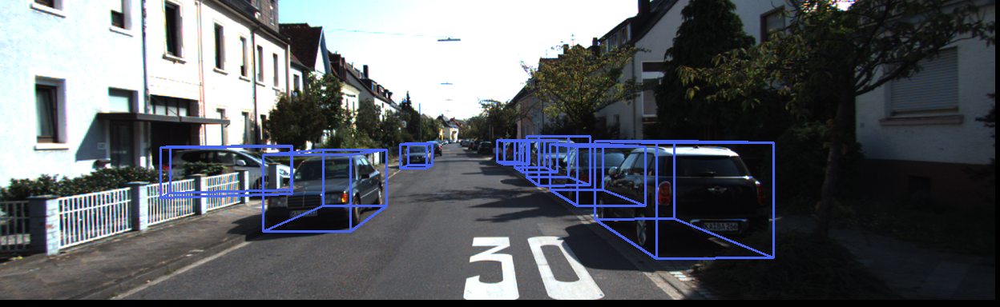
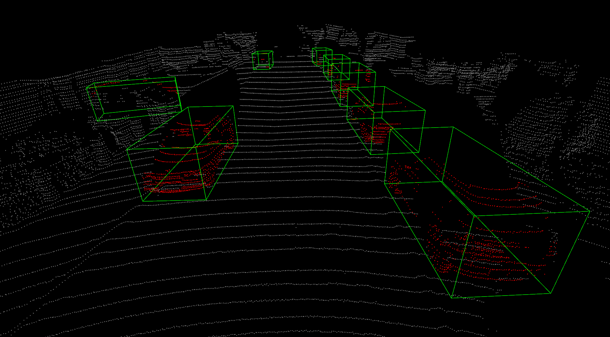

## Learning Auxiliary Monocular Contexts Helps Monocular 3D Object Detection

By Xianpeng Liu, [Nan Xue](https://xuenan.net/) and [Tianfu Wu](https://tfwu.github.io/)

## Introduction

This repository includes an official implementation of the paper ['Learning Auxiliary Monocular Contexts Helps Monocular 3D Object Detection'](https://arxiv.org/abs/2112.04628), 
and an unofficial implementation of the excellent work [MonoDLE](https://github.com/xinzhuma/monodle).
Motivated by the Cramer-Wold theorem in measure theory, MonoCon proposes a simple yet effective formulation for monocular 3D object detection without exploiting any extra information (lidar, depth, CAD, sequential, etc.). 
It proposes to learn Monocular Contexts, as auxiliary tasks in training, to help monocular 3D object detection. 
The key idea is that with the annotated 3D bounding boxes of objects in an image, there is a rich set of well-posed projected 2D supervision signals available in training, such as the projected corner keypoints and their associated offset vectors with respect to the center of 2D bounding box, which should be exploited as auxiliary tasks in training. 
It outperforms prior arts in terms of both accuracy and speed.






## Usage

### Installation

This repo is tested on python=3.6, cuda=10.1, pytorch=1.5.1, [mmcv-full=1.3.1](https://github.com/open-mmlab/mmcv), 
[mmdetection=2.11.0](https://github.com/open-mmlab/mmdetection), [mmsegmentation=0.13.0](https://github.com/open-mmlab/mmsegmentation) and 
[mmdetection3D=0.14.0](https://github.com/open-mmlab/mmdetection3d).

Note: mmdetection and mmdetection3D have made huge compatibility change in their latest versions. 
Their latest version is not compatible with this repo.
Make sure you install the correct version. 
We will update our code and make it compatible with their latest versions in the future, 
please stay tuned.

Follow instructions below to install:

- Create a conda environment

```
conda create -n monocon python=3.6
conda activate monocon
git clone https://github.com/Xianpeng919/MonoCon
cd MonoCon
```

- Install Pytorch 1.5.1

```
conda install pytorch==1.5.1 torchvision==0.6.1 cudatoolkit=10.1 -c pytorch
```

- Install mmcv-full=1.3.1

```
pip install mmcv-full==1.3.1 -f https://download.openmmlab.com/mmcv/dist/cu101/torch1.5.0/index.html
```

- Install mmdetection=2.11.0

```
cd ./mmdetection-2.11.0
pip install -r requirements/build.txt
pip install -v -e .
cd ..
```

- Install mmsegmentation=0.13.0

```
pip install mmsegmentation==0.13.0
```

- Install mmdetection3D=0.14.0. Refer to the [official instructions](https://mmdetection3d.readthedocs.io/en/latest/) 
 in mmdetection3d for more installation information.

```
cd ./mmdetection3d-0.14.0
pip install -v -e .
cd ..
```

- Adjust installed libs

```
pip install timm
pip uninstall pycocotools
pip uninstall mmpycocotools
pip install mmpycocotools
```

 
- Overwrite files in mmdetection-2.11.0 and mmdetection3D-0.14.0

```
cp -rT mmdetection-2.11.0-extra-monocon mmdetection-2.11.0/
cp -rT monocon mmdetection3d-0.14.0/
```


### Data Preparation

Download [KITTI](http://www.cvlibs.net/datasets/kitti/eval_object.php?obj_benchmark=3d) dataset and organize data 
 following the [official instructions](https://mmdetection3d.readthedocs.io/en/latest/)
  in mmdetection3D. Then generate data by running:
  
```
cd ./mmdetection3d-0.14.0
python create_data_tools_monocon/create_data.py kitti --root-path ./data/kitti --out-dir ./data/kitti --extra-tag kitti
```


### Training

```
# dir: ./mmdetection3d-0.14.0
CUDA_VISIBLE_DEVICES=0  python ./tools/train.py configs/monocon/monocon_dla34_200e_kitti.py
```


### Inference and Evaluation

```
# dir: ./mmdetection3d-0.14.0
CUDA_VISIBLE_DEVICES=0 python ./tools/test.py configs/monocon/monocon_dla34_inference_200e_kitti.py ./work_dirs/ur_ckpt_location --eval bbox
```

We provide pre-trained checkpoints. MonoDLE*'s model, config and pretrained weight will be released soon.
See the below table to check the performance. (Inference speed is tested on Nvidia 2080Ti)

|         | AP40@Easy | AP40@Mod. | AP40@Hard | FPS | Link      |
| ------- | --------- |-----------|-----------|-----|-----------|
| MonoCon | 26.33     | 19.03     | 16.00     | 40  | [Model](https://drive.google.com/file/d/1XOTGfehtT8Vnvhk2dvwEZAiW9gVlS1_M/view?usp=sharing) |


## License

This project is released under the [Apache 2.0 license](LICENSE).


## Citation

Please consider citing our paper in your publications if it helps your research.

```latex
@InProceedings{liu2022monocon,
    title={Learning Auxiliary Monocular Contexts Helps Monocular 3D Object Detection},
    author={Xianpeng Liu, Nan Xue, Tianfu Wu},
    booktitle = {36th AAAI Conference on Artifical Intelligence (AAAI)},
    month = {Feburary},
    year = {2022}
}

@article{li2019attentive,
  title={Attentive Normalization},
  author={Li, Xilai and Sun, Wei and Wu, Tianfu},
  journal={arXiv preprint arXiv:1908.01259},
  year={2019}
}
```

## Acknowledgement

This repo benefits from awesome works of [mmdetection](https://github.com/open-mmlab/mmdetection), 
[mmdetection3D](https://github.com/open-mmlab/mmdetection3d), [MonoDLE](https://github.com/xinzhuma/monodle),
[MonoFlex](https://github.com/zhangyp15/MonoFlex),
[RTM3D](https://github.com/Banconxuan/RTM3D).  Please also consider citing them.

## Contact

If you have any question about this project, please feel free to contact [xliu59@ncsu.edu](xliu59@ncsu.edu)

